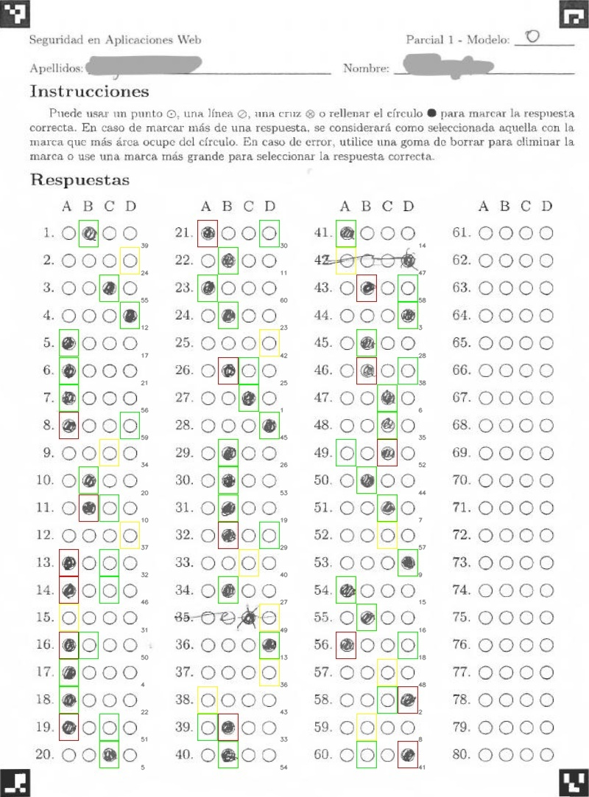

# Simple Test Scanner

This repository contains a set of Python applications designed for generating, scanning, and evaluating printed tests. The applications are built to work with LaTeX files and utilize OpenCV for image processing. Below is a detailed description of each application, its purpose, configuration, and functionality.

## `test.py`

The script generates randomized variations of a LaTeX test file, including randomized questions and options. Questions are extracted from a LaTeX file, and the script can generate multiple variations of the test with different randomizations. `(VARIANT)` is a placeholder for the number of variation being generated (0-based index).  

The script replicates the LaTeX structure. All content before the occurrence of `% Questions start here` and after `% Questions end here` is preserved in the output files.

The format of is questions has to be as follows:

```latex
  %- web
  \item ¿Ea non consequat velit culpa ut enim sit officia fugiat aliqua? 
  \begin{enumerate}
    \item Aliquip in excepteur aute ea adipisicing proident ut quis..
    \item Commodo qui exercitation fugiat quis sunt id.
    \item Id pariatur ex eiusmod est fugiat dolore incididunt et.
    \item Magna duis id voluptate ad labore et.
  \end{enumerate}
```

The category of the question is defined by the first line, which starts with `%-` and contains the category name. The correct answer should always be the first one in the list. Please respect the LaTeX structure and ensure that the questions are formatted correctly, **including the whitespaces and line breaks**.

By default, the script generates two columns for the answers. If you want to specify the number of columns, you can do so by adding `_X` to the category name, where `X` is the number of columns. For example, `%- web_3` will generate three columns for the answers.

LaTeX commands might be used in the questions. For example, the following question includes LaTeX commands for including an image and a source code listing:

```latex
%- html_1
  \item Sint eiusmod mollit sint esse commodo sit enim consequat consectetur in est ullamco.
  
  \begin{lstlisting}[language=HTML]
  <!DOCTYPE html>
  <html>
    <head><title>Page Title</title></head>
    <body>
      <h1>This is a Heading</h1>
    </body>
  </html>
  \end{lstlisting}

  \begin{figure}[tb]
    \centering
    \includegraphics[width=0.25\textwidth]{src/1/1}
    \vspace*{-5mm}
    \caption{Tabla HTML.}
    \label{fig:1}
  \end{figure}

  \begin{enumerate}
    \item  \hfill \vspace*{-7mm}
    \begin{lstlisting}[language=HTML]
<td>Row 2, Col 1</td>
    \end{lstlisting}
    \item  \hfill \vspace*{-7mm}
    \begin{lstlisting}[language=HTML]
<td>Row 20, Col 11</td>
    \end{lstlisting}
    \item  \hfill \vspace*{-7mm}
    \begin{lstlisting}[language=HTML]
<td>Row 2, Col 100</td>
    \end{lstlisting}
    \item  \hfill \vspace*{-7mm}
    \begin{lstlisting}[language=HTML]
<td>Row 200, Col 1</td>
    \end{lstlisting}
  \end{enumerate}
```

### Command line arguments for `test.py`

`--input`: Path to the input LaTeX file containing the test.

`--seed` (optional): Random seed for reproducibility.

`--variations` (optional): Number of test variations to generate (default: `1`).

`--answers` (optional): Flag to also generate LaTeX files with correct answers for each variation.

`--show_questions` (optional): Flag to display parsed questions in the console.

`--output`: Path to the output folder where generated files will be saved.

Example command:

```bash
python test.py --input test.tex --seed 42 --variations 3 --answers --show_questions --output output_folder
```

## `scanner.py`

The script can read an image or PDF file containing a questionnaire and extract the answers marked by the user. The script uses ArUco markers and OpenCV to process the image and identify the marked answers. Multiple regions containing answers matrix may be given as input. The script can also handle multiple pages in a PDF file. The output is a CSV file containing the extracted answers, which can be evaluated with the `eval.py` script. 

The script requires the installation of [Poppler](https://poppler.freedesktop.org/), a PDF rendering library, to handle PDF files. In Windows, a precompiled version of Poppler can be downloaded from [this GitHub repository](https://github.com/oschwartz10612/poppler-windows/releases/). The script will automatically detect the Poppler installation path if it is added to the system PATH variable or if Poppler is located in a subfolder of the script's directory. Please note that some LaTeX distributions include Poppler binaries, so the script may work without any additional installation in those cases.

### Command line arguments for `scanner.py`

`--input`: Path to the input image or PDF file containing the scanned questionnaire/s.

`--region`: Region dimensions in percentage format `top_left_x,top_left_y,bottom_right_x,bottom_right_y,rows`. Can be repeated for multiple regions.

`--answers` Path to the folder containing the answer files of the test variants (test_0_answers.tex, test_1_answers.tex, etc.).

`--show_regions` (optional): Flag to display the regions in the image.

`--variants` (optional): Path to a CSV file containing the assigned variant for each student test. If not provided, the script will use the variants found in the input folder sequentially (e.g., 0, 1, 2, 0, 1, 2, ...).

`--backrefs` (optional): Path to the CSV file containing the questions backrefs to the original questions for each test variant. If providec, the script will use the backrefs to reorder the questions in the output CSV file.

`--students-answers` (optional): Path to a CSV file containing the correct answers for each scanned student test. This is used to overwrite the scanned answers with the correct ones. This is useful for correcting errors in the scanned answers.

`--separator` (optional): Separator used in the CSV files (default: `','`).

`--decimal` (optional): Decimal separator used in the CSV files (default: `'.'`).

`--show_results` (optional): Flag to display the results in the console.

`--thresshold` (optional): Threshold for determining if a question is answered (default: `7`).

`--pb` (optional): Flag to show progress bar during processing.

`--check` (optional): Path to a CSV file containing the correct answers for each scanned student test. Testing purposes only.

`--correct` (optional): Score for a correct answer (default: `1.0`).

`--wrong` (optional): Penalty for a wrong answer (default: `-0.33`).

`--output`: Path to the output folder where processed images and CSV files will be saved.

Example command:

The following command scans a PDF file:

```bash
python scanner.py --input examples/example-scanned.pdf --check examples/example-scanned.csv --region 0.100,0.276,0.239,0.965,20 --region 0.335,0.276,0.475,0.965,20 --region 0.571,0.276,0.711,0.965,20 --region 0.807,0.276,0.946,0.965,20 --thresshold 7 --pb --answers examples/output --correct 1 --wrong -0.33 --variants examples/variants.csv --backrefs examples/output/backrefs.csv --separator ',' --decimal '.' --output examples/output
```

Afer running the command, the script will generate a CSV file with the scanned answers and images of the processed questionnaires. Let's use in this command a manually revised version of the CSV file, where the answers 35 and 42 of student 12 are corrected:

```bash
python scanner.py --input examples/example-scanned.pdf --students-answers examples/revised-answers.csv --region 0.100,0.276,0.239,0.965,20 --region 0.335,0.276,0.475,0.965,20 --region 0.571,0.276,0.711,0.965,20 --region 0.807,0.276,0.946,0.965,20 --thresshold 7 --pb --answers examples/output --correct 1 --wrong -0.33 --variants examples/variants.csv --backrefs examples/output/backrefs.csv --output examples/output
```

Below is an example of the processed questionnaire image generated by the script for the student 12:

